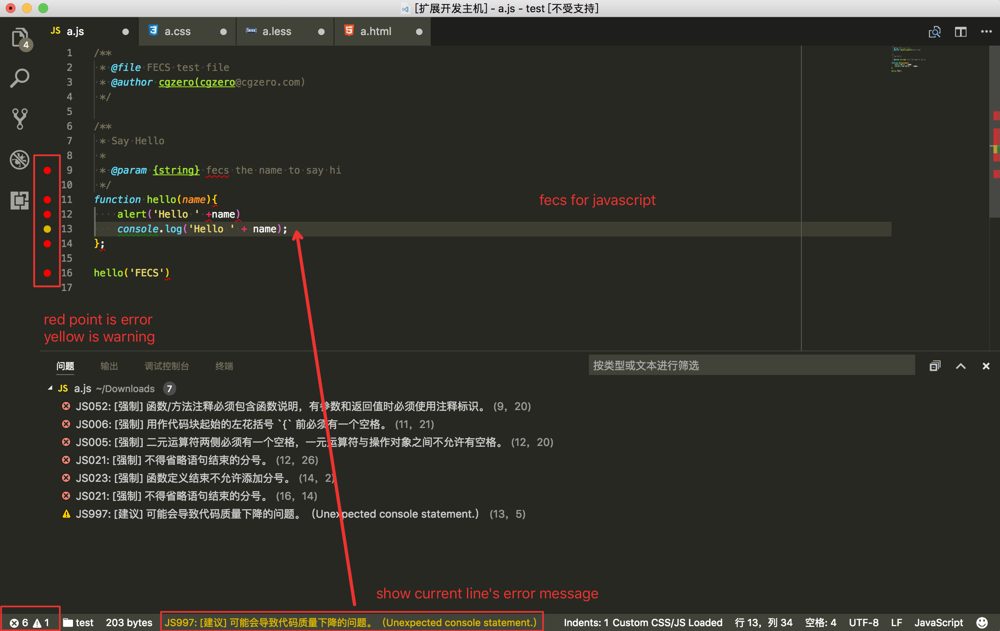
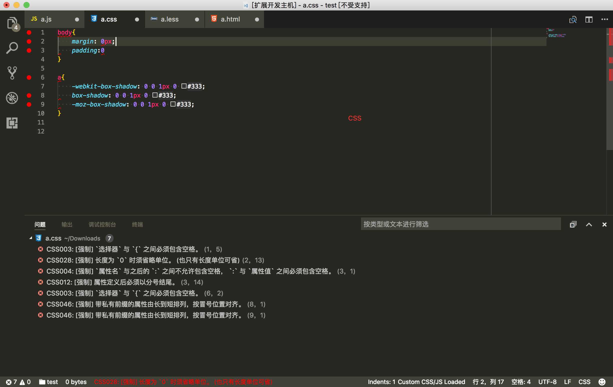
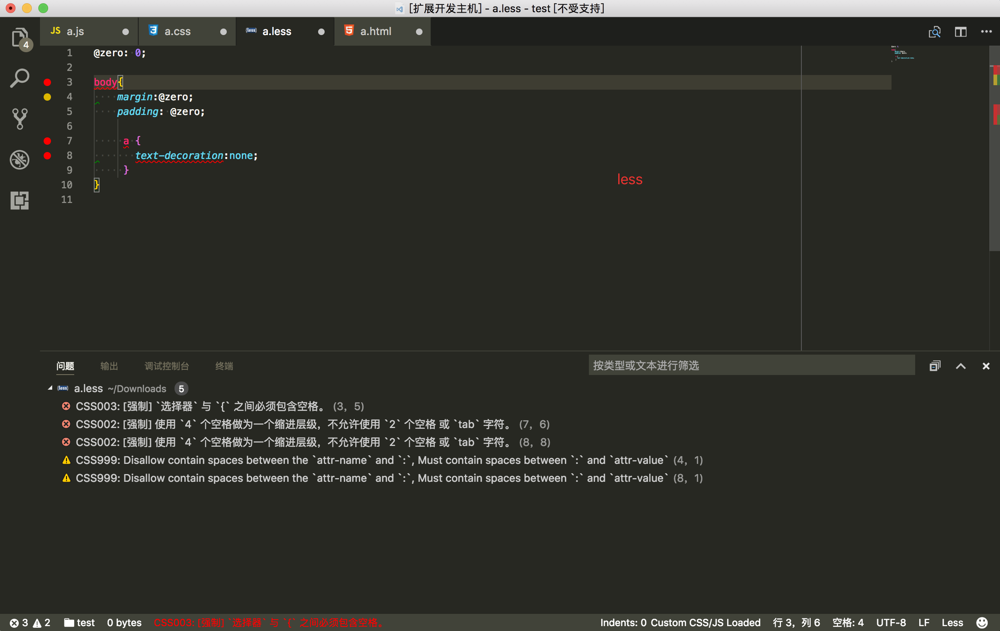
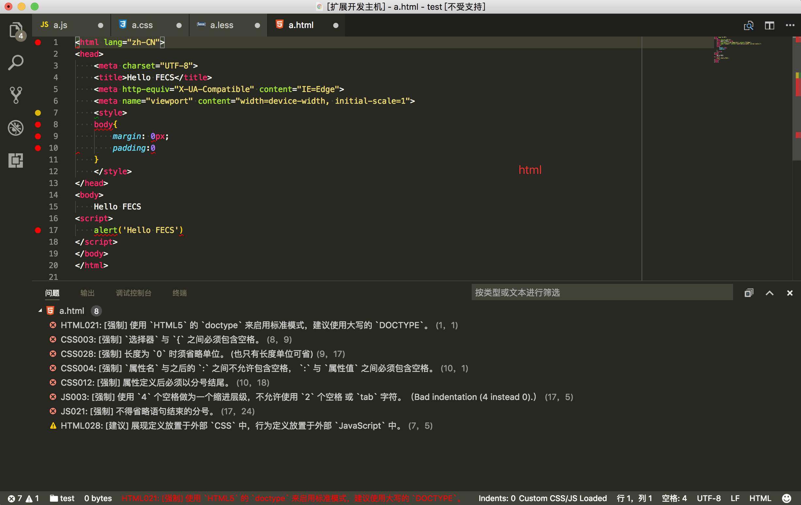
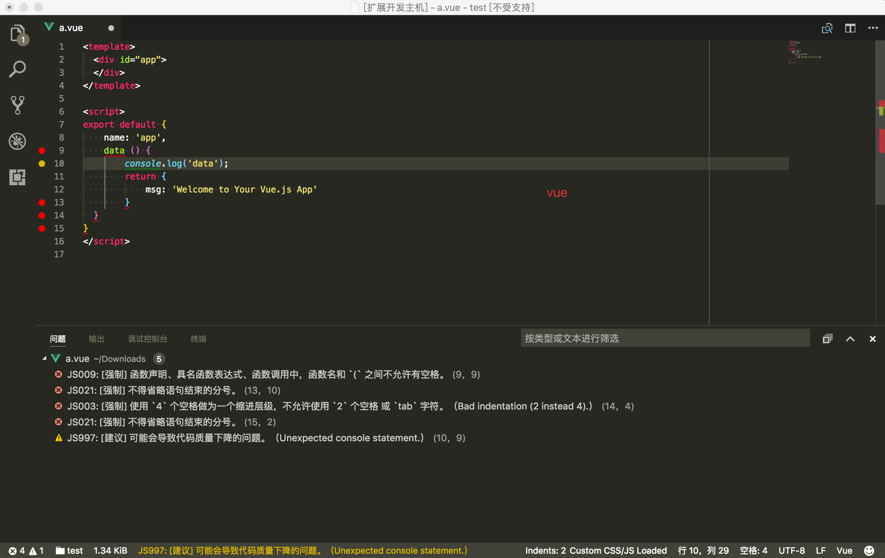

# fecsmat

A better fecs extension for vscode. This is inspired by [vscode-fecs-plugin](https://github.com/l5oo00/vscode-fecs-plugin)

## Install
- Install this extension: `ext install fecsmat`

*Tip: The plugin support fecs. So you do not need install fecs.*

## Features

### Fecs Check

- fecs for javascript

- fecs for css

- fecs for less

- fecs for html

- fecs for vue/san

### Fecs Format

- Run command: fecs format
- Shortcuts: cmd+shift+r

*Tip: The plugin support script tag format in san/vue file.*

## Thanks

- [FECS](http://fecs.baidu.com/)
- [vscode-fecs-plugin](https://github.com/l5oo00/vscode-fecs-plugin)

